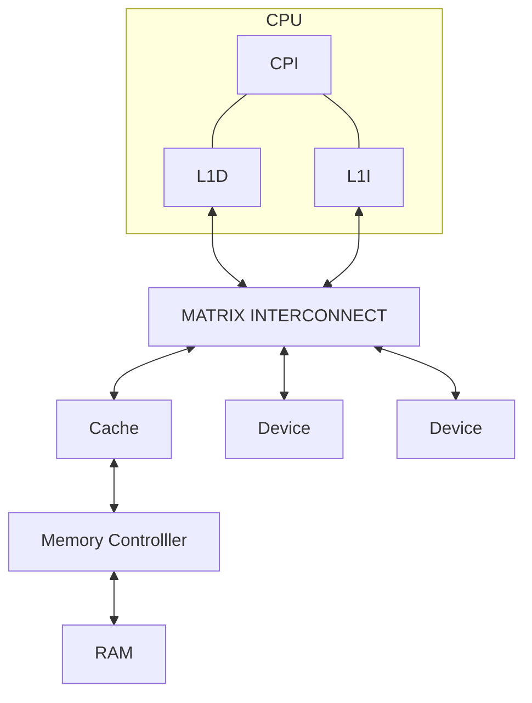
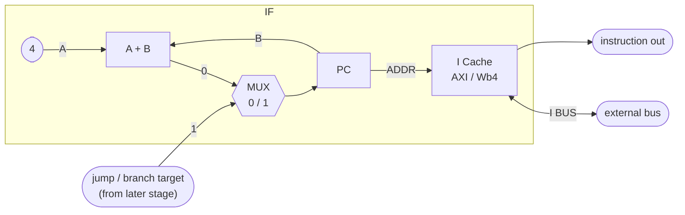
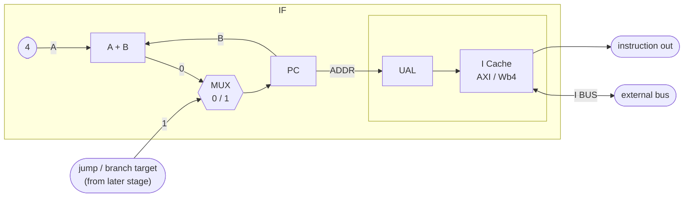

# QuantiumV

RISCV SoC Collab work.

Join On [Discord](https://discord.gg/sQjhBvWXjF) if you interested in the project!

---

# General SoC Architecture idea



---

# CPI - CoProcessor Interface

Basic idea of the coprocessor interface. This can later of extended.

This will allow custom instructions to be executed and registers passed to the coprocessor.

The ready and ack signals are a handshake in order to stall the processor's pipeline.

Signals:

```sv
wire rdy
wire ack
wire clk
wire [31:0] rd;
wire [31:0] rs1;
wire [31:0] rs2;
```

---

# Processor Components

- [ ] MMU
- [ ] MPU
- [ ] M Mode CSRs
- [ ] S Mode CSRs
- [ ] U Mode CSRs
- [ ] Memory Access Unit for instructions stream.
- [ ] Memory Access Unit for datga stream.
- [ ] Pipeline design.
- [ ] D Cache
- [ ] I Cache
- [ ] WB4 to AXI Bridge
- [ ] AXI to WB4 Bridge
- [x] ALU
- [x] Register File
- [ ] Fetch Stage
- [x] Decode Stage
- [ ] Execute Stage
- [ ] Memory Stage
- [ ] Write Back Stage
- [ ] Forwading Unit
- [ ] Hazard detection
- [ ] Pipeline Stall
- [ ] Branch Prediction
- [ ] D-I Cache Coherence

---

# First Stage Pipeline

No Unaligned memory access. CPU throws an unalinged memory access exemption.



Unaligned memory access control logic on the instruction cache. 
Pipeline stall while cache logic fetches data blocks and aligns them.



---

# Wishbone 4 interface

Use Advanced synchronous termination or simple synchrnous termination for the ACK signal.

It's not a requirement but it will lower the routing delay allowing for higher clock speeds.

For more information look at the following in the Wishbone spec:

- Chapter 4: WISHBONE Registered Feedback Bus Cycles
- Chapter 4.1: Introduction, Synchronous vs. Asynchronous cycle termination
- Illustration 4-2: WISHBONE Classic synchronous cycle terminated burst
- Illustration 4-3: Advanced synchronous terminated burst

```sv
interface WB4(input clk, input rst);
    logic ACK;
    logic ERR;
    logic RTY;
    logic STB;
    logic [31:0] ADR;
    logic CYC;
    logic [31:0] DAT_I;
    logic [31:0] DAT_O;
    logic WE;
    logic [2:0] CTI_O;
    modport slave(input clk, rst,
    input STB,
    input ADR,
    input CYC,
    output DAT_I,
    input  DAT_O,
    input CTI_O,
    output ACK,
    output ERR,
    output RTY,
    input WE);
    modport master(input clk, rst,
    output STB,
    output ADR,
    output CYC,
    input  DAT_I,
    output DAT_O,
    output CTI_O,
    input ACK,
    input ERR,
    input RTY,
    output WE);
endinterface //WB4
```

---

# Tools and Software

Quartus or Vivado will be convenient. Otherwise, the following are some open source alternatives:

- iverilog
- iverilator
- gtkwave

---
